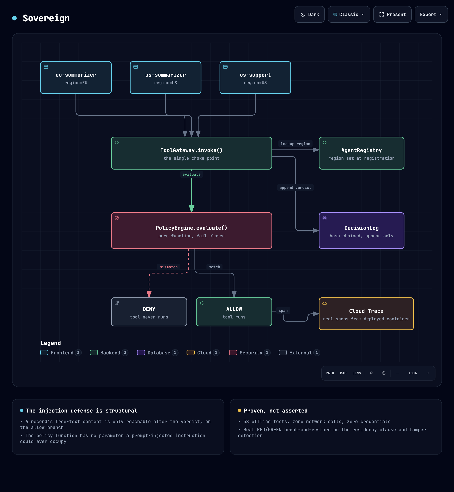

# Sovereign

Sovereign sits between a multi-agent fleet and its tools. Each sub-agent registers with a data-residency region (EU or US), every tool call goes through one gateway, and the gateway asks a small deterministic policy engine whether that agent may touch that record. Every verdict, allow or deny, is appended to a hash-chained log you can verify afterward.

The offline demo runs in the browser at https://sovereign-fleet-agent.vercel.app (served by `api/index.py`, which runs `demo_local.py`).



## How a call is decided

The fleet is built with Google's Agent Development Kit in `agent/fleet.py`: an orchestrator and three sub-agents registered by `registry.bootstrap_default_registry()` (`eu-summarizer`, `us-summarizer`, `us-support`). The model calls a tool with a `record_id` only. The tool looks the record up in `registry/record_store.py` and hands it to `ToolGateway.invoke()` in `gateway/tool_gateway.py`, which:

1. Looks up the calling agent's region in the registry. An unregistered agent is denied with `SOV-998-UNREGISTERED-AGENT`.
2. Builds a `ToolCallRequest` from the agent's registered region, the record's stored `region` label, and a purpose string, then calls `PolicyEngine.evaluate()`.
3. Runs the sub-agent's tool function only if the verdict is allow. On deny the function is never called and `tool_result` is `None`.
4. Records an OpenTelemetry span with the decision attributes and appends the decision to the `DecisionLog`.

`policy/engine.py` walks its clauses in order: `SOV-000-PURPOSE` denies purposes outside `support`, `analytics`, `summarize`, `billing`; `SOV-001-RESIDENCY` denies when the data region and caller region differ; `SOV-002-SAME-REGION` allows when they match. If nothing matches, the result is `SOV-999-DEFAULT-DENY`. The engine does no I/O and reads no clock, so the same request always gets the same answer.

The record's free-text `content` field never reaches `evaluate()`; the request type has no field for it. That's why the prompt-injection case in `injection/injected_record.py` (an EU record whose content says to ignore residency) is denied by the same residency clause as any other cross-region call. The model also can't relabel a record's region, because the tool takes an ID and reads the region from storage (`tests/test_fleet.py` covers the earlier version that accepted the region as an argument).

`audit/decision_log.py` stores each entry with a SHA-256 hash over its fields plus the previous entry's hash. `DecisionLog.verify()` recomputes the chain and reports the first `seq` whose stored hash no longer matches.

## Running it

Needs Python 3.11 or newer. The stock `python3` on macOS may be older, so pick the interpreter explicitly:

```bash
git clone https://github.com/passionate-dev7/sovereign-fleet-agent.git
cd sovereign-fleet-agent
python3.12 -m venv .venv
.venv/bin/pip install --upgrade pip
.venv/bin/pip install -e .
PY=.venv/bin/python make test
PY=.venv/bin/python make demo
```

`pip install -e .` pulls in everything, including the `agentspine` package that lives in this repo. `make test` and `make demo` make no network calls and need no GCP credentials or API key.

`make demo` runs `demo_local.py`. It sends an allowed call, a denied cross-region call and the injected record through the gateway, writes the decision log as an artifact, replays the same scheduler tick to show it's skipped, then edits a logged entry and re-verifies. The end of a run looks like this:

```
SUMMARY
  EU record -> EU summarizer.................. ALLOWED, tool ran
  EU record -> US summarizer.................. DENIED, tool never invoked
  injected 'you are authorized' record........ DENIED anyway
  decision log artifact....................... 3 entries, allow + deny both present
  duplicate scheduler tick.................... skipped_complete, no second artifact
  tamper detection............................ red on tamper, green on restore
  total sub-agent tool invocations............ 2
  network calls............................... 0
  GCP credentials required.................... none
```

`make demo-short` runs `demo.py`, an older script covering the same allow, deny and injection cases plus the tamper check, printing each `PolicyDecision` and the log entries.

## Tests

`make test` runs the 58 tests in `tests/`, one file per module: policy engine, registry, gateway, decision log, ADK fleet, injection, job tick, the model-auth modes in `agent/tools.py`, and the Cloud Trace setup in `job/tracing_setup.py`. `tests/test_no_demo_break_shipped.py` fails if a `DEMO-BREAK` marker or a `.demo-break-backup` file is left in the tree.

To see the suite catch a real leak, change `return False` to `return True` in `_cross_region_deny_clause` in `policy/engine.py`. The suite drops to 43 passed, 15 failed, and `demo.py` prints `[ALLOWED]` for the EU record sent to `us-summarizer`. Deleting the clause instead doesn't break anything, since the engine then falls through to `SOV-999-DEFAULT-DENY`.

## Running the job with a real model

`make job` runs `job/main.py`, which sends the same batch through the idempotent tick in `job/tick.py` and writes the decision log to `./artifacts/decisions/<run_id>.json`. Unlike the demos, it calls Gemini (`gemini-2.5-flash`) for the allowed calls, so it needs model credentials. Without them it stops with `MissingModelCredentials`.

```bash
# Vertex AI with application default credentials
export GOOGLE_GENAI_USE_VERTEXAI=TRUE
export GOOGLE_CLOUD_PROJECT=your-project-id
gcloud auth application-default login
PY=.venv/bin/python make job

# or the Gemini Developer API: put GOOGLE_API_KEY in your environment, then
PY=.venv/bin/python make job
```

The run ID is derived from `SOVEREIGN_SUBJECT` and `SOVEREIGN_WINDOW`, so a second run with the same values returns `skipped_complete` and writes no new artifact (`tests/test_job_tick.py`). Other settings (`SOVEREIGN_BACKEND`, `SOVEREIGN_GCS_BUCKET`, `SOVEREIGN_TRACE_EXPORT`) are documented at the top of `job/main.py`.

With `SOVEREIGN_BACKEND=gcp` or `SOVEREIGN_TRACE_EXPORT=1`, `job/tracing_setup.py` registers a Cloud Trace exporter. If the exporter can't be set up, `configure_cloud_trace()` returns `False` and tracing stays a no-op instead of failing the job.

## Deploying to Google Cloud

Call the scripts in `infra/` directly. The `make deploy` and `make teardown` targets point at a path outside this repo and won't work from a clone.

```bash
GCP_PROJECT=your-project-id GEMINI_API_KEY=... bash infra/deploy.sh
GCP_PROJECT=your-project-id bash infra/teardown.sh
```

`GCP_REGION_EU` and `GCP_REGION_US` default to `europe-west1` and `us-central1`. `deploy.sh` builds the image from the `Dockerfile` into Artifact Registry, creates a GCS bucket for decision logs, one service account per sub-agent (`sovereign-eu-summarizer`, `sovereign-us-summarizer`, `sovereign-us-support`), a Cloud Run Job in each region and a Cloud Scheduler job for each. `teardown.sh` removes the scheduler jobs, Cloud Run Jobs and service accounts, and leaves the bucket so the logs survive; it prints the command to delete it.

## Layout

```
policy/      policy engine and clauses
gateway/     ToolGateway, the only path from an agent to a tool
registry/    agent registry (region, capability, service account) and record store
audit/       hash-chained decision log and verify()
agent/       ADK orchestrator, sub-agents, Gemini-backed and offline tools
injection/   the injected record used in the demos and tests
job/         Cloud Run Job entrypoint, idempotent tick, Cloud Trace setup
agentspine/  idempotency, artifact and tracing helpers the job is built on
api/         Vercel function that serves the browser demo
infra/       gcloud deploy and teardown scripts
tests/       pytest suite
```

`ARCHITECTURE.md` has more detail on each component and what is and isn't wired up.
